# System Audit & Gap Analysis — Recurva Subscription Billing Engine

**Date:** 2026-07-04  
**Scope:** Read-only codebase investigation  
**Method:** Manual trace through all source code, test files, database schema, configuration, and documentation. Every claim below is traceable to specific file:line references.

---

## Section 1 — System Overview (As-Is)

### 1.1 What the system actually does

Recurva is a **multi-tenant subscription billing API**, purpose-built for the Nigerian market, integrated exclusively with **Nomba** as the payment processor. It allows merchants (tenants) to:

- Define billing plans (fixed-price, metered, or mixed) with multiple currency pricing
- Register customers and attach payment methods (card tokenization via Nomba)
- Create subscriptions that generate recurring invoices on a schedule
- Run a daily billing cycle that charges customers automatically
- Handle payment failures through a configurable dunning/retry mechanism
- Support mid-cycle plan changes with credit/charge proration
- Apply coupon discounts (percentage or fixed amount)
- Report metered usage per subscription
- Issue refunds via Nomba
- Receive inbound webhooks from Nomba (charge success/failure, refund completion, checkout callback)
- Send outbound webhooks to tenants for subscription lifecycle events
- Provide a customer self-service portal (view subscriptions/invoices, pause/resume/cancel)
- Provide an admin dashboard (MRR, churn, subscriber counts, dunning metrics)
- Generate revenue reports, cohort analysis, and CLV estimates
- Audit-log all resource changes

**What the code proves it does NOT do today:**
- No tax calculation (VAT, sales tax, etc.) at any point
- No invoice PDF generation (invoice downloads return JSON only)
- No automated email sending in the billing/dunning lifecycle (email library exists but is not wired into business flows)
- No multi-processor support (Nomba only, called directly from billing logic)
- No multi-currency _settlement_ or FX conversion (multi-currency at schema level only)
- No smart dunning (statically configured retry schedule)
- No prepaid wallet/top-up flow (credit balance exists but as a proration byproduct only)

### 1.2 Critical request/data flows

#### Flow A: Customer subscribes via hosted checkout

```
Merchant                          Recurva                              Nomba                    Customer
  |                                 |                                    |                         |
  | POST /v1/checkout              |                                    |                         |
  | (planId, customerId, ...)      |                                    |                         |
  |-------------------------------->|                                    |                         |
  |                                 | createSubscription()               |                         |
  |                                 |   -> status='incomplete'           |                         |
  |                                 | insertPendingCheckout()            |                         |
  |                                 | createCheckoutSession()            |                         |
  |                                 |------------------------------------>|                        |
  |                                 |<-----------------------------------| (checkoutUrl)           |
  |<--------------------------------| (checkoutUrl)                      |                         |
  |                                 |                                    |                         |
  |                                 |    (customer redirected to Nomba)  |                         |
  |                                 |                                    | Customer completes       |
  |                                 |                                    | card entry on Nomba     |
  |                                 |    POST /webhooks/nomba/checkout   |<------------------------|
  |                                 |<-----------------------------------|                         |
  |                                 | verify HMAC-SHA256 signature       |                         |
  |                                 | findPendingCheckoutForUpdate()     |                         |
  |                                 | insertPaymentMethod()              |                         |
  |                                 | markPendingCheckoutConsumed()      |                         |
  |                                 | transitionState(CHECKOUT_COMPLETED)|                         |
  |                                 |   -> status='active'               |                         |
  |                                 | promoteToPrimary()                 |                         |
  |                                 | (200 OK)                           |                         |
  |                                 |------------------------------------>|                        |
```

**Files:** `src/webhooks/inbound/nomba.ts` (line 72-138), `src/api/routes/checkout.routes.ts`, `src/domain/subscription/subscription.service.ts` (createSubscription), `src/domain/nomba/nomba.service.ts` (createCheckoutSession), `src/nomba/client.ts` (checkout method, line 109-130)

#### Flow B: Recurring billing cycle (daily cron)

```
Scheduler (every 60s)             billing.service                     Nomba
  |                                 |                                    |
  | shouldRunBilling()             |                                    |
  | (checks BILLING_CRON="0 6 * * *")                                   |
  |                                 |                                    |
  | runBillingCycle()              |                                    |
  | acquireBillingLock()           |                                    |
  | (PG advisory lock 0x52454355525641)                                 |
  |                                 |                                    |
  | findDueForBilling(now, 50)     |                                    |
  |   -> subscriptions WHERE       |                                    |
  |      current_period_end <= now |                                    |
  |      AND status IN (active,    |                                    |
  |      past_due, trialing)       |                                    |
  |<--------------------------------|                                    |
  |                                 |                                    |
  | for each subscription:          |                                    |
  | billSubscription(tx)           |                                    |
  |   -> findSubscriptionForUpdate  |                                    |
  |   -> buildInvoice()            |                                    |
  |   -> finalizeInvoice()         |                                    |
  |   -> if amountDue <= 0: mark   |                                    |
  |      paid, advance period      |                                    |
  |   -> if no payment method:     |                                    |
  |      PAYMENT_FAILED, dunning   |                                    |
  |   -> insertCharge()            |                                    |
  |   -> chargeCard(tenant, token, |                                    |
  |      amount, currency)          |------------------------------------>|
  |                                 |<-----------------------------------| (success/failure)
  |   -> updateChargeStatus()      |                                    |
  |   -> updateInvoiceStatus()     |                                    |
  |   -> decrementCreditBalance()  |                                    |
  |   -> updateSubscriptionPeriod()|                                    |
  |   -> if failed: transitionState|                                    |
  |      (PAYMENT_FAILED)          |                                    |
  |                                 |                                    |
  | finalizeBillingRun()           |                                    |
  | releaseBillingLock()           |                                    |
```

**Files:** `src/scheduler/billing.ts` (all), `src/scheduler/runner.ts` (shouldRunBilling logic), `src/domain/billing/billing.service.ts` (billSubscription, lines 30-124), `src/nomba/client.ts` (charge method, lines 84-107)

#### Flow C: Payment failure and dunning

```
charge.failure webhook  OR  billing cycle failure
  |                                    
  v
transitionState(PAYMENT_FAILED)
  -> status='past_due'
  -> sideEffects: ['START_DUNNING']
  |
  v
executeSideEffects()
  -> initiateDunning()
     -> load dunning policy (or DEFAULT_RETRY_SCHEDULE)
     -> create DunningAttempt rows:
        [{day:0,useBackup:true}, {day:1}, {day:3}, {day:7}, {day:10}]
     -> each scheduledAt = now + day*86400000
     -> adjustForSalaryCycle() (24-27 -> 28th)
  |
  v
Dunning scheduler (every 60s):
  executeDunningRetries()
    -> findScheduledDunningAttempts(now)
    -> for each attempt:
       -> findOpenInvoiceForSubscription()
       -> retryCharge(tx)
          -> tries primary payment method
          -> if none, tries backup
          -> chargeCard() via Nomba
       -> updateDunningAttempt(status)
       -> if failed:
          -> evaluatePolicy()
             -> if all attempts exhausted:
                finalAction='cancel' -> CANCEL event
                finalAction='mark_unpaid' -> MAX_DUNNING_REACHED event
       -> if succeeded:
          -> PAYMENT_SUCCESS event
          -> cancelScheduledDunning()
```

**Files:** `src/scheduler/dunning.ts` (all), `src/domain/dunning/dunning.service.ts` (all), `src/domain/billing/billing.service.ts` (retryCharge, lines 126-220), `src/webhooks/inbound/nomba-webhook.ts` (handleChargeFailure, lines 101-166)

#### Flow D: Mid-cycle plan change

```
Merchant                                    Recurva
  |                                           |
  | POST /v1/subscriptions/:id/change-plan    |
  | { newPlanId, immediate: true }            |
  |------------------------------------------>|
  |                                           |
  | changePlan()                               |
  |  -> calculateProration(                   |
  |       oldPlanAmount,                      |
  |       newPlanAmount,                      |
  |       cycleStart, changeDate, cycleEnd)   |
  |     Returns: {creditAmount, chargeAmount, |
  |               netAmount, daysRemaining,   |
  |               dailyOldRate, dailyNewRate}  |
  |                                           |
  |  -> if netAmount > 0:                     |
  |       create proration invoice            |
  |       (line item type='proration')        |
  |  -> if netAmount < 0:                     |
  |       add |netAmount| to credit_balance   |
  |       (no refund issued)                  |
  |  -> updateSubscriptionPlan()              |
  |                                           |
  |<------------------------------------------| (updated subscription)
```

**Files:** `src/domain/subscription/subscription.service.ts` (changePlan), `src/domain/proration/proration.service.ts` (calculateProration, pure function)

### 1.3 Tech stack

| Component | Technology | Detail |
|-----------|-----------|--------|
| Runtime | **Bun** 1.3+ | JavaScript runtime, package manager, test runner, bundler |
| Web framework | **Hono** 4.7+ | Ultrafast, middleware-based, TypeScript-native |
| Database | **PostgreSQL 16** | Single instance, no read replicas |
| DB client | **postgres.js** 3.4 | Tagged-template raw SQL, no ORM, `camel` transform enabled |
| Auth | **bcryptjs** + **jsonwebtoken** | API key (Bearer), dashboard JWT, portal magic-link JWT |
| Payment | **Nomba** | Nigerian processor. Test/live mode per tenant. |
| Card storage | **AES-256-GCM** | Encrypted card tokens via `ENCRYPTION_KEY` |
| Email | **Resend** | Library exists but NOT wired into business flows |
| Logging | **Pino** | Structured JSON logging, pino-pretty in dev |
| Error tracking | **Sentry** (optional) | Conditional on `SENTRY_DSN` |
| Scheduler heartbeat | **Healthchecks.io** (optional) | For dunning scheduler |
| CI/CD | **GitHub Actions** | Typecheck + test + migrate on push; auto-deploy to Oracle Cloud |
| Deployment | **Docker** + **Nginx** | Multi-stage Bun build, Let's Encrypt SSL |

### 1.4 Hardcoded vs configurable

| Aspect | Status | Detail |
|--------|--------|--------|
| Payment processor | **Hardcoded** | Nomba only. No interface/abstraction layer. `createNombaClient()` called directly from `nomba.service.ts` which is called from `billing.service.ts` (lines 91, 193). |
| Currency | **Configurable** (per schema) | `plan_currencies.currency` CHECK `('NGN','USD','GBP','EUR')`. `customers.currency` defaults to `'NGN'`. `subscriptions.currency` from same set. Billing operations pass `subscription.currency` through to Nomba. |
| Tax rate | **Not implemented** | Zero tax logic anywhere. No tax fields on plans, invoices, or line items. |
| Billing schedule | **Configurable** | `BILLING_CRON` env var (default `'0 6 * * *'`), interpreted by `shouldRunBilling()` in `runner.ts`. |
| Dunning schedule | **Configurable** (per policy) + hardcoded default | `dunning_policies.retry_schedule` is JSONB. But `initiateDunning()` falls back to `DEFAULT_RETRY_SCHEDULE = [{day:0,useBackup:true}, {day:1}, {day:3}, {day:7}, {day:10}]` if no policy found (`dunning.service.ts:41`). |
| Plan structure | **Configurable** | Plans have `interval` (day/week/month/year), `interval_count`, `billing_type` (fixed/metered/mixed), `trial_days`, and per-currency pricing. |
| Webhook signing | **Configurable** | Per-endpoint `signing_secret` generated on registration. Inbound Nomba webhook uses `NOMBA_WEBHOOK_SECRET`. |
| Max payment methods | **Hardcoded** | `MAX_PAYMENT_METHODS = 5` in `payment-method.service.ts`. |
| Dunning retries before cancel | **Configurable** (via policy) | `retry_schedule` array length + `final_action` field. Default schedule has 5 entries. |
| Outbound webhook max retries | **Hardcoded** | `MAX_ATTEMPTS = 5`, `BACKOFF_MINUTES = [1, 5, 30, 120, 480]` in `delivery.ts`. |

---

## Section 2 — Module-by-Module Breakdown

### 2.1 Auth

**What it does:** Three distinct authentication systems:
1. **Tenant API key auth** (primary): Bearer token `rcv_live_{64-hex}`. Hash stored in `tenant_api_keys`. Verified via `authenticateTenant()` using bcrypt comparison. Prefix-based lookup for performance.
2. **Dashboard admin auth**: Email/password login via `tenant_admin_credentials`. Issues JWT (HS256, 24h expiry) with `role: 'admin'`.
3. **Portal auth**: Magic-link flow. Requests a signed JWT (15min), exchanges for a portal session JWT (1h expiry). Portal JWT contains `{tenantId, customerId, email}`.

**Where it lives:**
- API key auth middleware: `src/api/middleware/tenant-auth.ts` (lines 1-26)
- Tenant service (key generation, auth): `src/domain/tenant/tenant.service.ts` (lines 1-88)
- Dashboard auth: `src/dashboard/routes/index.ts` (lines 30-58)
- Portal auth: `src/portal/routes/index.ts` (lines 1-50, portalAuth middleware at lines 55-65)

**How it's triggered:**
- `tenantAuthMiddleware` applied inline on each route file (e.g., `router.use('*', tenantAuthMiddleware)` in every route module)
- `POST /v1/dashboard/auth` for dashboard login
- `POST /v1/portal/auth/request` + `GET /v1/portal/auth/verify` for portal sessions

**Dependencies:** `bcryptjs`, `jsonwebtoken`, `db/queries/tenant.queries`

**State it owns:** `tenants` table, `tenant_api_keys` table, `tenant_admin_credentials` table

**Known limitations:**
- No role-based access control beyond `admin` vs. absence for API key holders (all API key auth is effectively super-admin)
- No token refresh mechanism for dashboard/portal JWTs (they expire hard)
- API key lookup uses prefix matching which leaks key prefix in timing (mitigated by bcrypt comparison on the actual hash)
- No rate limiting on dashboard auth endpoint (`POST /v1/dashboard/auth`)

### 2.2 Payment processing

**What it does:** Encapsulates all Nomba API interaction. Three operations: `charge` (tokenized card payment), `checkout` (hosted checkout session), `refund` (bank transfer refund).

**Where it lives:**
- Nomba client (HTTP layer): `src/nomba/client.ts` (lines 1-155)
- Nomba domain service (thin wrapper): `src/domain/nomba/nomba.service.ts` (lines 1-18)
- Types: `src/domain/nomba/nomba.types.ts`

**How it's triggered:**
- `chargeCard()` called from `billing.service.ts` (line 91 in `billSubscription`, line 193 in `retryCharge`)
- `createCheckoutSession()` called from `checkout.routes.ts` (line 52)
- `refund()` called from `invoice.routes.ts` (line 50)

**Dependencies:** `config.ts` (all Nomba credentials), `errors.ts` (`NombaTimeoutError`), `observability/report-error.ts`

**State it owns:** None (stateless, purely HTTP calls). However, it uses an in-memory `cachedToken` variable with `tokenExpiresAt` (client.ts line 7-8) — this is a global singleton that does NOT vary by tenant. If two tenants with different credentials are used, the second tenant's requests will use the first tenant's cached token.

**Known limitations (hardcoded assumptions):**
- **Nomba only.** No abstraction layer (no `PaymentProcessor` interface). Adding a second processor requires touching `billing.service.ts`, `nomba.service.ts`, `checkout.routes.ts`, `invoice.routes.ts`, and webhook handlers.
- **Singleton token cache** (`cachedToken` in `client.ts:7`) ignores per-tenant credentials. Multiple tenants with different Nomba accounts will share tokens incorrectly.
- **No idempotency** on the Nomba HTTP layer itself (idempotency is handled upstream by the billing service checking for pending charges).
- **Mock token path:** When `clientId`/`clientSecret` are empty, the client returns `'mock_token_for_testing'` silently (client.ts:16). This can mask configuration errors.
- **Refund endpoint:** Uses `/v2/transfers/bank/` which is a bank transfer endpoint, not a card refund endpoint. This may be the correct Nomba API for refunds, but the naming is misleading.
- **Timeouts:** Hardcoded to `config.NOMBA_REQUEST_TIMEOUT_MS` (default 15s). No retry logic on transient network failures.

### 2.3 Subscription/plan management

**What it does:**
- **Plans:** CRUD for billing plans. Supports fixed-price, metered, and mixed billing types. Per-currency pricing in `plan_currencies`.
- **Subscriptions:** Full lifecycle management — create (trialing/incomplete/active), cancel (immediate or at period end), pause, resume, change plan. Powered by a pure-function state machine with 8 states and 11 events.

**Where it lives:**
- Plan service: `src/domain/plan/plan.service.ts` (lines 1-71)
- Subscription service: `src/domain/subscription/subscription.service.ts` (lines 1-245)
- State machine: `src/domain/subscription/subscription.state-machine.ts` (lines 1-76)
- Side effect dispatcher: `src/domain/subscription/side-effect.dispatcher.ts` (lines 1-68)
- Types: `src/domain/plan/plan.types.ts`, `src/domain/subscription/subscription.types.ts`
- Routes: `src/api/routes/plan.routes.ts`, `src/api/routes/subscription.routes.ts`

**How it's triggered:** REST API endpoints (`/v1/plans/*`, `/v1/subscriptions/*`), all require `tenantAuthMiddleware`.

**Dependencies:**
- Subscription service -> State machine, Coupon service, Proration service, DB queries
- Side-effect dispatcher -> Billing service, Dunning service, Webhook service
- Plan service -> DB queries

**State it owns:** `plans`, `plan_currencies`, `subscriptions`, `subscription_metered_usage`, `coupon_redemptions`

**Known limitations:**
- **Immediate plan changes only.** `changePlan()` always sets `immediate: true`. No scheduled/"next period" plan changes.
- **Downgrade credits are non-refundable.** Net negative proration adds to `credit_balance` but cannot be paid out. Credits can only be consumed against future invoices.
- **No plan versioning.** Changing a plan's price affects all subscriptions already on that plan at next billing (because pricing is re-read from `plan_currencies` at invoice time, not snapshot on subscription creation).
- **`cancelSubscription()` with `cancelAtPeriodEnd` does not invoke state machine.** It just sets a database flag (`cancel_at_period_end = TRUE`). No side effects fire.
- **The `SCHEDULE_CANCELLATION` side effect has no handler.** It's declared in the state machine's transition table but `executeSideEffects()` in `side-effect.dispatcher.ts` has no case for it (inferred: scheduled jobs should detect `cancel_at_period_end` and process them, but no such job exists).

### 2.4 Billing cycle / invoice generation

**What it does:**
- `billSubscription()`: The core billing function. Within a transaction: builds an invoice for the current period, finalizes it, charges the customer's card via Nomba, and advances the subscription period. Handles credit balance consumption and zero-amount invoices.
- `buildInvoice()`: Creates invoice with line items. Computes plan amount (fixed + metered usage), applies coupon discount, applies credit balance, generates idempotency key from `sha256("invoice_{subscriptionId}_{periodStart}")`.
- `runBillingCycle()`: Orchestrates batch billing using PostgreSQL advisory locks and `FOR UPDATE SKIP LOCKED`.

**Where it lives:**
- Billing service: `src/domain/billing/billing.service.ts` (lines 1-220)
- Invoice service: `src/domain/invoice/invoice.service.ts` (lines 1-167)
- Billing scheduler: `src/scheduler/billing.ts` (lines 1-108)
- Scheduler runner: `src/scheduler/runner.ts` (lines 1-86)

**How it's triggered:**
- **Scheduled:** `runBillingCycle()` called every 60s from `startSchedulers()`, but only executes if `shouldRunBilling()` returns true (checks `BILLING_CRON` against current UTC time, once per day).
- **On-demand:** Retry via `POST /v1/invoices/:id/retry` -> `retryCharge()`.

**Dependencies:**
- Billing -> Invoice service (buildInvoice, finalizeInvoice)
- Billing -> Nomba service (chargeCard)
- Billing -> Subscription service (transitionState)
- Billing -> Side effect dispatcher (executeSideEffects)
- Invoice -> Coupon service (validateCoupon, applyDiscount)
- Invoice -> Usage aggregation queries

**State it owns:** `invoices`, `invoice_line_items`, `charges`, `billing_runs`

**Known limitations:**
- **No VAT/tax calculation.** The `buildInvoice()` function never computes or adds tax. No tax fields exist on invoices or line items.
- **No invoice numbering.** Invoices are identified by UUID. No sequential invoice numbers.
- **No invoice PDF generation.** The portal's `/invoices/:id/download` returns JSON, not a PDF.
- **Metered billing aggregates in real-time at invoice time.** Usage is summed with `SUM(quantity)` for the period. No pre-rating or tiered pricing.
- **Coupon duration logic is approximate.** The `buildInvoice()` checks if a coupon is still active by comparing `durationMonths` against months since first redemption. This uses calendar months rather than billing periods, which can mis-align with irregular intervals.
- **Billing lock is advisory (not row-level).** Uses PostgreSQL advisory lock `0x52454355525641`. This prevents concurrent billing runs across processes but does not prevent data races with concurrent API calls (e.g., cancellation during billing).
- **`findDueForBilling` returns `past_due` subscriptions** but the query in `subscription.queries.ts` uses anti-join on invoices which may have edge cases with voided invoices or retries.

### 2.5 Dunning

**What it does:** Manages the retry lifecycle for failed payments. Creates a schedule of retry attempts (one per DunningAttempt row), executes them via a scheduler, and takes final action when all attempts are exhausted (cancel subscription or mark as unpaid).

**Where it lives:**
- Dunning service: `src/domain/dunning/dunning.service.ts` (lines 1-95)
- Dunning scheduler: `src/scheduler/dunning.ts` (lines 1-84)
- Types: `src/domain/dunning/dunning.types.ts`
- Routes: `src/api/routes/dunning-policy.routes.ts`

**How it's triggered:**
- `initiateDunning()` called from `side-effect.dispatcher.ts` as a side effect of `PAYMENT_FAILED` transition
- Dunning retries executed every 60s by `executeDunningRetries()` scheduler
- Policy evaluation happens inline after each failed retry

**Dependencies:**
- Dunning service -> `db/queries/dunning.queries`
- Dunning scheduler -> Invoice queries, Subscription queries, Billing service (retryCharge), Dunning service (evaluatePolicy), Subscription service (transitionState)

**State it owns:** `dunning_policies`, `dunning_attempts`

**Known limitations:**
- **Hardcoded default schedule.** If no dunning policy exists for a tenant, `initiateDunning()` uses `[{day:0,useBackup:true}, {day:1}, {day:3}, {day:7}, {day:10}]` (`dunning.service.ts:41`). These are statically defined.
- **No backup card rotation in `retryCharge()`.** The `retryCharge()` function tries `subscription.paymentMethodId` first, then `findBackupPaymentMethod()`. But the dunning scheduler's `executeDunningRetries()` sets `usedBackupCard: attempt.attemptNumber > 1` regardless of which card was actually used.
- **No smart dunning.** The schedule is purely calendar-day-based from the initial failure. No adaptive timing based on card BIN, amount, or historical recovery patterns.
- **No customer communication.** Dunning retries are silent — no email, SMS, or push notifications are sent to the customer. The email library exists but is not integrated.
- **No webhook events for dunning lifecycle.** Outbound webhooks fire for subscription state changes (activated, cancelled, etc.) but there's no dedicated dunning attempt event.
- **`adjustForSalaryCycle()` is Nigeria-specific.** Shifts dates 24th-27th to the 28th. Hardcoded assumption about Nigerian salary cycles.
- **Dunning policy CRUD** is exposed via API but the `dunning-policy.routes.ts` calls DB queries directly rather than going through a domain service, unlike other modules.

### 2.6 Proration

**What it does:** Pure function `calculateProration()` that computes the credit/charge delta when a plan changes mid-cycle. Covers upgrade (customer owes more), downgrade (customer gets credit), and cancellation (customer gets credit for unused time).

**Where it lives:** `src/domain/proration/proration.service.ts` (lines 1-50)

**How it's triggered:** Called from `changePlan()` in `subscription.service.ts` (line 178)

**Dependencies:** None (pure function, no DB or IO)

**State it owns:** None

**Known limitations:**
- **Uses `Math.floor` for all division.** This means rounding is always downward (toward zero for positive amounts), which is correct for amounts owing but may short-change customers on credit calculations by 1 kobo/cent per day.
- **Separate interval periods supported but the only caller doesn't use them.** `calculateProration` accepts optional `oldPlanIntervalDays`/`newPlanIntervalDays`, but `changePlan()` in `subscription.service.ts` calls it without these (uses default behavior which assumes both plans have the same interval length as the current period).
- **No percentage-based proration.** All calculations use daily-rate (amount/days) even for annual plans. This is standard but means the refund for an annual plan cancelled after 1 month is `amount * 334/365` (approximately), not `amount * 11/12`.
- **Fixed dates for period calculation.** Uses `cycleStart`, `changeDate`, `cycleEnd` — all `Date` objects. Does not handle timezone-aware period boundaries beyond what the caller passes in.

### 2.7 Webhooks

**What it does:** Three webhook subsystems:
1. **Inbound from Nomba:** Two endpoints — `/webhooks/nomba/checkout` (checkout.completed callback) and `/webhooks/nomba` (charge.success, charge.failure, refund.completed events). Both verify HMAC-SHA256 signatures.
2. **Outbound to tenants:** Registered endpoints receive events for subscription lifecycle (activated, cancelled, notification). Uses outbox pattern: events are enqueued to DB, delivered async by a scheduler. HMAC-SHA256 signed with per-endpoint secret.
3. **Dead letter queue:** Unknown/unhandled inbound events go to `dead_letter_webhooks` table.

**Where it lives:**
- Inbound checkout callback: `src/webhooks/inbound/nomba.ts` (lines 1-148)
- Inbound Nomba webhook: `src/webhooks/inbound/nomba-webhook.ts` (lines 1-230)
- Outbound delivery: `src/webhooks/outbound/delivery.ts` (lines 1-104)
- Webhook endpoint management: `src/domain/webhook/webhook.service.ts` (lines 1-121)
- Types: `src/domain/webhook/webhook.types.ts`
- Routes: `src/api/routes/webhook.routes.ts`

**How it's triggered:**
- Inbound: POST from Nomba (no auth middleware, HMAC verified in handler)
- Outbound: `processOutboundDeliveries()` scheduled every 60s

**Dependencies:**
- Inbound -> Subscription service (transitionState), DB queries (pending-checkout, payment-method, subscription, invoice, webhook-events)
- Outbound -> Webhook service (signPayload), DB queries (delivery, endpoint)
- Webhook service -> crypto module, dns module (SSRF validation)

**State it owns:** `webhook_endpoints`, `webhook_deliveries`, `webhook_events`, `dead_letter_webhooks`

**Known limitations:**
- **Idempotency via `ON CONFLICT DO NOTHING` on `webhook_events(nomba_event_id)`.** This means if the same Nomba event arrives twice, the second is silently dropped (the DB insert returns nothing, all downstream logic is skipped). This is correct for Nomba events but means duplicate webhook deliveries do NOT trigger any reprocessing.
- **Outbound delivery retries are fire-and-forget.** Failed deliveries are retried up to 5 times with exponential backoff, but there's no dead-letter queue for outbound deliveries. After max retries, the delivery is marked `failed` and no further action is taken.
- **Outbound delivery uses `fetch()` with no timeout** for the actual HTTP call to the tenant's endpoint (`delivery.ts:32`). A slow endpoint can block the entire delivery cycle.
- **SSRF protection** in `webhook.service.ts` does a DNS lookup and rejects private IPs. This is good but means DNS resolution failures will reject the endpoint.
- **No webhook event schema versioning.** Outbound payloads are the raw `payload` JSON stored in the database. There's no version field or envelope schema.
- **No retry endpoint for failed inbound webhooks.** If a Nomba webhook is missed (e.g., server down), there's no mechanism to replay it. Nomba would need to re-send.
- **The outbound delivery scheduler** uses `findPendingDeliveries(sql, now, 50)` which picks up deliveries where `next_retry_at <= now` OR status is `pending`. This is batched at 50 per cycle.

### 2.8 Currency handling

**What it does:** Multi-currency is supported at the data model level but all business logic operates on whatever currency the subscription carries.

**Schema evidence:**
- `plan_currencies.currency` CHECK `('NGN','USD','GBP','EUR')` — migration 0002
- `customers.currency` DEFAULT `'NGN'`, CHECK same set — migration 0003
- `subscriptions.currency` CHECK same set — migration 0005
- `invoices.currency` NOT NULL — migration 0007
- `charges.currency` NOT NULL — migration 0007

**Code evidence:**
- `billSubscription()` passes `subscription.currency` to `chargeCard()` as-is (line 94)
- `buildInvoice()` finds plan price matching subscription currency
- Coupon `fixed_amount` type has an optional `currency` field and is validated against subscription currency
- Reports (`/v1/reports/revenue`) accept optional `currency` query parameter and group by currency

**Known limitations:**
- **No FX conversion.** All multi-currency support is "keep in original currency." There is no currency conversion, no multi-currency settlement, and no exchange rate handling.
- **Customer default is NGN.** `customers.currency DEFAULT 'NGN'` means all customers default to Naira unless explicitly set otherwise. The checkout flow does not allow the customer to choose a currency.
- **Nomba is primarily NGN.** The Nomba API likely handles NGN natively. Foreign currency charges may fail or behave unexpectedly.
- **No currency validation on subscription creation.** API validators accept any of the 4 currencies but don't check if the plan actually has a price in that currency (the DB query would just return no price, which would cause `buildInvoice()` to produce a zero-amount invoice).

### 2.9 Coupon management

**What it does:** Full coupon lifecycle — create, validate, apply, track redemptions. Supports percentage and fixed-amount discounts. Duration controls (once, repeating up to N months, forever).

**Where it lives:** `src/domain/coupon/coupon.service.ts` (lines 1-65)

**How it's triggered:** REST API (`/v1/coupons/*`), called from `buildInvoice()` in invoice service, called from `createSubscription()` in subscription service.

**Dependencies:** DB queries (`coupon.queries.ts`)

**State it owns:** `coupons`, `coupon_redemptions`

**Known limitations:**
- **Fixed-amount coupons are currency-specific.** They must match the subscription currency to be valid.
- **Redemption count increment** is NOT done in the same transaction as subscription creation (`coupon.service.ts:recordRedemption` uses a separate UPDATE, not within the subscription creation transaction). This can result in over-redemption under race conditions.
- **Duration counting uses calendar months.** `buildInvoice()` increments `monthsApplied` based on calendar months since first redemption, which is imprecise for 5-week months or irregular intervals.

### 2.10 Customer-facing surfaces

#### Dashboard (admin)
- **What exists:** Auth (email/password), metrics endpoint (`/dashboard/metrics`) returning active/trialing/past_due/cancelled subscriber counts, MRR per currency, churn rate. Dunning metrics endpoint (`/dashboard/dunning-metrics`) returning failed today/total, recovery rate, scheduled attempts.
- **Where:** `src/dashboard/routes/index.ts`
- **What's missing:** No UI (API-only). These are REST endpoints — no HTML templates, no frontend assets served.

#### Portal (customer self-service)
- **What exists:** Magic-link auth flow (request token, verify, get session JWT). Authenticated endpoints for listing subscriptions (with plan name), listing invoices, downloading invoice (JSON), cancel (set at period end), pause, resume, change plan.
- **Where:** `src/portal/routes/index.ts`
- **What's missing:** No UI (API-only). No payment method management in portal. No usage meters display. No dunning status.

#### Email notifications
- **What exists:** Full email infrastructure — Resend-based email client, 6 HTML templates (welcome, verification, password reset, subscription created, payment receipt, payment failed), sender profiles (default, billing, security, support, notifications).
- **Where:** `src/infrastructure/email/`
- **What's missing: The email service is NEVER CALLED from any business flow.** There is no call to `sendPaymentReceipt()` or `sendPaymentFailedEmail()` anywhere in the billing service, dunning service, or side-effect dispatcher. The only use is a test endpoint `POST /v1/email/test`. Email is infrastructure without integration.

### 2.11 Reports / Analytics

**What exists:**
- `/v1/reports/revenue` — Revenue grouped by daily/monthly interval, filtered by date range and currency
- `/v1/reports/cohorts` — Customer retention cohorts (monthly)
- `/v1/reports/clv` — Customer Lifetime Value by plan
- `/v1/reports/dunning` — Dunning success/failure metrics (truncated in read)

**Where:** `src/reports/routes/index.ts`

**How it's triggered:** Admin JWT auth (not API key)

**Known limitations:**
- All reports are direct SQL queries, no aggregation cache or materialized views
- Revenue and CLV queries scan the `invoices` table with no time-based partitioning (will degrade as data grows)
- No MRR trend over time endpoint (only current MRR from dashboard metrics)
- No churn cohort analysis beyond raw retention counts
- No forecast/prediction capability

### 2.12 Modules that are described in docs but the code proves are absent or stubbed

| Described feature | Actual state |
|-----------------|-------------|
| Email in billing lifecycle | Email library present but not wired into any business flow. `src/infrastructure/email/` has 7 files, 6 templates, but zero call sites in domain logic. |
| Scheduled cancellation | `SCHEDULE_CANCELLATION` side effect has no handler in `side-effect.dispatcher.ts`. No scheduled job detects `cancel_at_period_end` subscriptions. |
| Pause/resume trial | `PAUSE_TRIAL`, `PAUSE_BILLING`, `RESUME_BILLING` side effects declared in state machine but have no handlers in dispatcher. |
| Smart dunning | Dunning uses static retry schedule. No machine learning, no adaptive timing. |
| Invoice PDF download | Portal's `/invoices/:id/download` returns raw JSON, not a PDF. |

---

## Section 3 — Test Suite Review

### 3.1 Coverage inventory

| Module | Unit tests | Integration tests | Test files |
|--------|-----------|-------------------|------------|
| Auth / Tenant | None | None | — |
| Payment processing (Nomba) | None | 2 | `tests/integration/nomba-callback.test.ts`, `tests/integration/nomba-webhook.test.ts` |
| Subscription state machine | Yes | 0 | `tests/unit/domain/subscription.state-machine.test.ts` |
| Subscription service | None | 0 | — |
| Plan management | None | 0 | — |
| Billing cycle / Invoice | None | 1 (partial) | `tests/integration/billing-lifecycle.test.ts` |
| Dunning | Yes (minimal) | 0 (unit: 1 file) | `tests/unit/domain/dunning.policy.test.ts` |
| Proration | Yes | 0 | `tests/unit/domain/proration.service.test.ts` |
| Coupon | Yes | 0 | `tests/unit/domain/coupon.service.test.ts` |
| Webhook (inbound) | Yes | 2 | `tests/unit/webhooks/nomba-callback.test.ts`, `tests/integration/nomba-callback.test.ts`, `tests/integration/nomba-webhook.test.ts` |
| Webhook (outbound) | Yes (signing only) | 0 | `tests/unit/webhooks/verify.test.ts` |
| Observability | 3 files | 0 | `tests/unit/observability/*.test.ts` |
| Portal | None | 0 | — |
| Dashboard / Reports | None | 0 | — |
| Email | None | 0 | — |
| Side-effect dispatcher | None | 0 | — |
| DB queries (all 15 files) | None | 0 | — |

### 3.2 Coverage quality assessment (per test file)

#### `tests/unit/domain/coupon.service.test.ts` — **Adequate**
- Tests: `applyDiscount` pure function — percentage, fixed-amount, capping, zero subtotal, floor rounding.
- Failure paths: None (this is a pure function with no failure modes).
- Mocks: None needed (pure function).
- Assertions: Specific (`toBe(1000)` not `toBeTruthy()`).
- Verdict: Adequate for the scope of a pure arithmetic function.

#### `tests/unit/domain/proration.service.test.ts` — **Strong**
- Tests: 10 test cases covering upgrade, downgrade, cancellation, zero-day edge case, annual periods, leap year, monthly-to-annual upgrade, first-day cancel, last-day cancel.
- Failure paths: None (pure function).
- Assertions: Specific, validates intermediate values (`dailyOldRate`, `dailyNewRate`, `creditAmount`, `chargeAmount`, `netAmount`, `daysRemaining`, `daysInPeriod`).
- Verdict: Strong. The best-tested module in the system.

#### `tests/unit/domain/subscription.state-machine.test.ts` — **Strong**
- Tests: Every valid transition for `incomplete`, `trialing`, `active`, `past_due`, `paused`, `cancelled` states. Also tests invalid transitions (4 cases).
- Verifies side effects on key transitions (`ACTIVATE`, `BILL_NOW`, `START_DUNNING`).
- Assertions: Specific (`toBe('active')`, `toContain('ACTIVATE')`).
- Verdict: Strong. The state machine is well-covered including negative tests. Only weak spot: `ended` and `unpaid` states have no explicit test cases.

#### `tests/unit/domain/dunning.policy.test.ts` — **Weak**
- Tests: Only `adjustForSalaryCycle()` — 2 test cases (inside range, outside range).
- NOT tested: `initiateDunning()`, `evaluatePolicy()`, `detectSelfCure()`, `getNextRetryTime()`, `recordAttempt()`.
- This file tests a single date-adjustment utility, not the core dunning logic.
- Verdict: Weak. The dunning service is effectively untested beyond a helper function.

#### `tests/unit/webhooks/nomba-callback.test.ts` — **Weak**
- Tests: HMAC signature logic, tamper detection, card detail extraction, required fields.
- NOT tested: The actual `handleNombaCheckoutCallback` function. These tests re-implement the signing logic rather than testing the handler.
- Mocks: None. Tests construct payloads and verify cryptographic output.
- Verdict: Weak. Tests the signing concept but not the actual webhook handler.

#### `tests/unit/webhooks/verify.test.ts` — **Adequate**
- Tests: `signPayload` — signature format, payload uniqueness, secret uniqueness.
- Verdict: Adequate for a 10-line function.

#### `tests/unit/observability/*.test.ts` (3 files) — **Adequate**
- Tests: Sentry init skip, healthcheck URL ping, report-error Sentry calls.
- Mocks: `mock.module('@sentry/node', ...)` for all 3.
- Verdict: Adequate. Basic coverage for observability wrappers.

#### `tests/integration/nomba-callback.test.ts` — **Strong**
- Tests: Full checkout callback flow — endpoint call, signature verification, subscription activation, payment method saving.
- Failure paths: Missing signature (401), tampered signature (401), idempotency (dup returns `already_processed`).
- Mocks: None — uses real Bun.serve() and real PostgreSQL. Payment processor is NOT mocked (but the callback test doesn't call Nomba — it tests the webhook endpoint that Nomba would call).
- Assertions: Specific — checks DB state after each operation (subscription status, payment method ID).
- Setup/teardown: Proper `beforeAll`/`afterAll` with data cleanup.
- Verdict: Strong. Good integration coverage of the checkout callback endpoint.

#### `tests/integration/nomba-webhook.test.ts` — **Strong**
- Tests: `charge.failure` webhook processing — charge status updates, subscription transitions to `past_due`, dunning attempt creation.
- Failure paths: Missing signature (401), wrong signature (401), already-processed (idempotent), invoice already paid guard, charge already failed guard.
- Mocks: None — real server, real DB.
- Setup/teardown: Creates test data (tenant, customer, plan, subscription, invoice, charge, dunning policy) and cleans up after all tests.
- Verdict: Strong. The best integration test — covers success and multiple failure modes, verifies DB state.

#### `tests/integration/billing-lifecycle.test.ts` — **Strong (limited scope)**
- Tests: 5 test cases covering amount_paid setting, credit balance deferral/decrement/restore on void, state machine transitions in integration, `findDueForBilling` returns `past_due`, dunning attempt clearance on cancel, dunning uniqueness.
- Mocks: None — real DB. But note: these tests do NOT call the Nomba API — they test the invoice/dunning/subscription logic in isolation.
- Assertions: Specific — checks exact numeric values.
- Verdict: Strong for what it tests. But scope is narrow — no billing cycle tests with real card charging.

### 3.3 Structural issues

1. **No unit tests for the billing service.** `billSubscription()` and `retryCharge()` (220 lines of the most critical business logic) have zero tests. These are the functions that handle actual money movement.

2. **No tests for the invoice service.** `buildInvoice()` (the pricing and discount logic) has no dedicated tests.

3. **No tests for the side-effect dispatcher.** `executeSideEffects()` orchestrates billing, dunning, and webhook calls but has no tests.

4. **No tests for any DB query file.** All 15 query files are untested in isolation.

5. **Integration tests are potentially flaky.** They depend on a shared test database (`docker-compose.test.yml` on port 5433). Test order dependency risk: `billing-lifecycle.test.ts` shares the DB with `nomba-webhook.test.ts` and `nomba-callback.test.ts`. If tests run in parallel, they will collide on data. If they run sequentially, test pollution from prior failures could cascade.

6. **No `.only` or `.skip` markers found** in the current test files (clean).

7. **No distinction between unit/integration/e2e** at the config level. The directory structure separates them (`tests/unit/` vs `tests/integration/`) but the test runner treats them identically.

8. **CI config** (`.github/workflows/ci.yml`) runs `bun run migrate` then `bun test`. This means integration tests run as part of every CI run, which is good. But the CI uses the same `docker-compose.test.yml` for the DB.

### 3.4 Per-module verdicts

| Module | Verdict | Evidence |
|--------|---------|----------|
| Auth / Tenant | **Absent** | No test files. |
| Payment processing (Nomba) | **Weak** | Nomba client and nomba service have zero tests. Integration tests cover the webhook endpoints only (which call domain services, but not the Nomba HTTP calls which are a hard dependency). |
| Subscription state machine | **Strong** | 16 test cases covering all valid and 4 invalid transitions. |
| Subscription service | **Absent** | `createSubscription`, `changePlan`, `cancelSubscription`, `pauseSubscription`, `resumeSubscription` all untested. |
| Plan management | **Absent** | No tests for plan CRUD. |
| Billing cycle / Invoice | **Weak** | No unit tests for `billSubscription` or `buildInvoice`. Integration tests cover credit balance and state machine mechanics but not the actual charging flow. |
| Dunning | **Weak** | Only `adjustForSalaryCycle` tested. Core functions (`initiateDunning`, `evaluatePolicy`, `detectSelfCure`) untested. |
| Proration | **Strong** | 10 test cases covering all payment scenarios. Best-tested module. |
| Coupon | **Adequate** | `applyDiscount` well tested. `validateCoupon` and `recordRedemption` untested. |
| Webhook inbound | **Adequate** | Signature verification tested in isolation. Integration tests cover the handler for `charge.failure` well. Checkout callback handler tested in integration. |
| Webhook outbound | **Weak** | Only `signPayload` tested. Delivery scheduler, retry logic, tenant notification all untested. |
| Side-effect dispatcher | **Absent** | No tests for the function that wires billing, dunning, and webhooks together. |
| Portal | **Absent** | No tests for portal routes or auth flow. |
| Dashboard / Reports | **Absent** | No tests. |
| Email infrastructure | **Absent** | Entire 7-file email module untested. |

---

## Section 4 — System Architecture Diagram

```mermaid
graph TB
    subgraph External
        MERCHANT["Merchant / Tenant"]
        CUSTOMER["End Customer"]
        NOMBA["Nomba Payment Processor"]
        RESEND["Resend (Email)"]
        SENTRY["Sentry (Error Tracking)"]
        HC["Healthchecks.io"]
    end

    subgraph "API Layer (Hono)"
        ROOT["app.ts - Root Router"]
        WEBHOOK_IN["/webhooks/nomba/*<br/>No auth, no rate limit"]
        V1["/v1 Router<br/>Rate limiter<br/>Idempotency"]
        MIDDLEWARE["requestId, logging,<br/>error handler"]
    end

    subgraph "V1 Routes"
        TENANT_R["/tenants"]
        PLAN_R["/plans"]
        COUPON_R["/coupons"]
        CUSTOMER_R["/customers"]
        PAYMETHOD_R["/payment-methods"]
        SUB_R["/subscriptions"]
        INVOICE_R["/invoices"]
        WEBHOOK_R["/webhooks/endpoints"]
        CHECKOUT_R["/checkout"]
        DUNNING_R["/dunning-policies"]
        USAGE_R["/:id/usage"]
        EMAIL_R["/email/test"]
        PORTAL_R["/portal (customer)"]
        DASHBOARD_R["/dashboard (admin)"]
        REPORTS_R["/reports"]
    end

    subgraph "Domain Layer"
        TENANT_S["Tenant Service<br/>src/domain/tenant/"]
        PLAN_S["Plan Service<br/>src/domain/plan/"]
        CUSTOMER_S["Customer Service<br/>src/domain/customer/"]
        PAYMETHOD_S["Payment Method Service<br/>src/domain/payment-method/"]
        SUB_S["Subscription Service<br/>src/domain/subscription/"]
        STATE_MACHINE["State Machine<br/>subscription.state-machine.ts"]
        SIDE_EFFECT["Side-Effect Dispatcher<br/>side-effect.dispatcher.ts"]
        INVOICE_S["Invoice Service<br/>src/domain/invoice/"]
        BILLING_S["Billing Service<br/>src/domain/billing/"]
        DUNNING_S["Dunning Service<br/>src/domain/dunning/"]
        PRORATION_S["Proration Service<br/>src/domain/proration/"]
        COUPON_S["Coupon Service<br/>src/domain/coupon/"]
        USAGE_S["Usage Service<br/>src/domain/usage/"]
        NOMBA_S["Nomba Service<br/>src/domain/nomba/"]
        WEBHOOK_S["Webhook Service<br/>src/domain/webhook/"]
        PORTAL_S["Portal Service<br/>src/domain/portal/"]
    end

    subgraph "Infrastructure Layer"
        NOMBA_CLIENT["Nomba HTTP Client<br/>src/nomba/client.ts<br/><strong>Singleton token cache</strong>"]
        EMAIL_SVC["Email Service<br/>src/infrastructure/email/<br/><strong>NOT wired to business</strong>"]
        OBSERVABILITY["Sentry + Pino<br/>src/observability/"]
    end

    subgraph "Schedulers (in-process, 60s intervals)"
        BILLING_SCHED["Billing Cycle<br/>src/scheduler/billing.ts<br/>Advisory lock + cron"]
        DUNNING_SCHED["Dunning Retries<br/>src/scheduler/dunning.ts"]
        DELIVERY_SCHED["Outbound Webhook<br/>Delivery<br/>src/webhooks/outbound/delivery.ts"]
    end

    subgraph "Database Layer"
        DB["PostgreSQL 16<br/>src/db/client.ts<br/>postgres.js (raw SQL)"]
        QUERIES["15 Query Files<br/>src/db/queries/*.queries.ts"]
        MIGRATIONS["17 Migration Files<br/>migrations/"]
    end

    %% Connections - External to API
    MERCHANT -->|"HTTPS"| V1
    CUSTOMER -->|"HTTPS"| PORTAL_R
    NOMBA -->|"POST webhooks"| WEBHOOK_IN

    %% API Router connections
    ROOT --> WEBHOOK_IN
    ROOT --> V1
    V1 --> TENANT_R & PLAN_R & COUPON_R & CUSTOMER_R & PAYMETHOD_R
    V1 --> SUB_R & INVOICE_R & WEBHOOK_R & CHECKOUT_R
    V1 --> DUNNING_R & USAGE_R & EMAIL_R
    V1 --> PORTAL_R & DASHBOARD_R & REPORTS_R

    %% Route to Domain service connections
    TENANT_R --> TENANT_S
    PLAN_R --> PLAN_S
    COUPON_R --> COUPON_S
    CUSTOMER_R --> CUSTOMER_S
    PAYMETHOD_R --> PAYMETHOD_S
    SUB_R --> SUB_S
    SUB_R --> SIDE_EFFECT
    INVOICE_R --> INVOICE_S
    INVOICE_R --> BILLING_S
    INVOICE_R --> NOMBA_S
    CHECKOUT_R --> SUB_S
    CHECKOUT_R --> NOMBA_S
    DUNNING_R --> DUNNING_S
    USAGE_R --> USAGE_S
    PORTAL_R --> PORTAL_S
    PORTAL_R --> SUB_S
    PORTAL_R --> SIDE_EFFECT
    DASHBOARD_R --> DB
    REPORTS_R --> DB

    %% Domain module inter-dependencies
    SUB_S --> STATE_MACHINE
    SUB_S --> COUPON_S
    SUB_S --> PRORATION_S
    SIDE_EFFECT --> BILLING_S
    SIDE_EFFECT --> DUNNING_S
    SIDE_EFFECT --> WEBHOOK_S
    BILLING_S --> INVOICE_S
    BILLING_S --> NOMBA_S
    BILLING_S --> SUB_S
    INVOICE_S --> COUPON_S
    DUNNING_SCHED --> BILLING_S
    DUNNING_SCHED --> DUNNING_S
    DUNNING_SCHED --> SUB_S

    %% Infrastructure connections
    NOMBA_S --> NOMBA_CLIENT
    NOMBA_CLIENT --> NOMBA
    EMAIL_SVC --> RESEND
    OBSERVABILITY --> SENTRY
    DELIVERY_SCHED --> WEBHOOK_S

    %% Database connections (all services go through DB)
    TENANT_S --> QUERIES
    PLAN_S --> QUERIES
    CUSTOMER_S --> QUERIES
    PAYMETHOD_S --> QUERIES
    SUB_S --> QUERIES
    INVOICE_S --> QUERIES
    BILLING_S --> QUERIES
    DUNNING_S --> QUERIES
    COUPON_S --> QUERIES
    USAGE_S --> QUERIES
    NOMBA_S --> QUERIES
    WEBHOOK_S --> QUERIES
    BILLING_SCHED --> QUERIES
    DUNNING_SCHED --> QUERIES
    DELIVERY_SCHED --> QUERIES
    QUERIES --> DB

    %% Highlight coupling points
    style NOMBA_S fill:#ff9999,stroke:#ff0000
    style BILLING_S fill:#ffcccc,stroke:#ff0000
    style NOMBA_CLIENT fill:#ff9999,stroke:#ff0000
    style EMAIL_SVC fill:#cccccc,stroke:#999999
```



### Key coupling points highlighted

1. **`NOMBA_S` (nomba.service.ts) called from 3 places:** `billing.service.ts` (lines 91, 193), `checkout.routes.ts` (line 52), `invoice.routes.ts` (line 50). Each call site instantiates `createNombaClient(tenant)` directly. There is no central payment processor interface.

2. **`BILLING_S` (billing.service.ts) is the most coupled module:** calls invoice service, nomba service, subscription service (transitionState), side-effect dispatcher, and DB queries for invoices, subscriptions, payment methods, and tenants. Any change to payment processing touches this file.

3. **`SIDE_EFFECT` (side-effect.dispatcher.ts) is a coupling hub:** wires billing, dunning, and webhook services together based on state machine output. Not tested.

4. **`DB` is a coupling point:** All modules depend on `getDb()` from `db/client.ts`. The singleton pattern means all tests share the same connection pool, creating implicit test coupling.

---

## Section 5 — Gap Analysis Against Target Spec

**Note:** No feature spec document was attached to this prompt. The analysis below is based on the roadmap items mentioned in the prompt instructions: multi-processor payment abstraction, multi-currency, Nigerian VAT/e-invoicing compliance, smart dunning, proration, prepaid wallets, self-service portal, revenue analytics, processor routing.

| Feature | Status | Evidence | Current-state blocker or enabler |
|---------|--------|----------|--------------------------------|
| **Multi-processor payment abstraction** | **Not present** | `chargeCard()` in `billing.service.ts` (lines 91-97, 193-199) calls `nomba.service.ts` which calls `createNombaClient()` directly. No `PaymentProcessor` interface. No strategy pattern. | **Hard.** Adding a second processor requires: (1) creating a processor interface, (2) refactoring `billing.service.ts` (2 call sites), `checkout.routes.ts` (1 call site), `invoice.routes.ts` (1 call site), `webhooks/inbound/` (2 files), and `nomba.service.ts`. The coupling is scattered across 7+ files. |
| **Multi-currency (beyond schema)** | **Partially present** | Schema supports NGN/USD/GBP/EUR. Currency flows through to Nomba charges. Reports group by currency. But: (1) Nomba likely only supports NGN, (2) no FX handling, (3) no multi-currency settlement, (4) `customers` default to NGN. | **Med.** The data model supports it. The main blockers are: Nomba's currency support, lack of FX provider integration, and lack of per-currency dunning/retry handling. If adding a second processor that supports more currencies, the schema is ready but the payment processing abstraction (above) is a prerequisite. |
| **Nigerian VAT/e-invoicing compliance** | **Not present** | Zero tax logic. No tax fields on any table (`invoices`, `invoice_line_items`, `plans`). No tax rate configuration. No e-invoicing format output (invoice download returns raw JSON). | **Med-Hard.** Adding VAT: (1) `buildInvoice()` needs tax calculation logic, (2) schema needs tax fields on invoices/line items, (3) needs configurable tax rates per plan/tenant, (4) invoice PDF generation needed for e-invoicing. The current `buildInvoice()` function (invoice.service.ts:30-120) would need significant refactoring to insert tax line items. The data model is additive so no migrations break existing data. |
| **Smart dunning** | **Not present** | Static retry schedule. `DEFAULT_RETRY_SCHEDULE` hardcoded in `dunning.service.ts:41`. No machine learning. No A/B testing. No card-type-aware timing. | **Easy to Low-Med.** The dunning architecture is clean: `DunningPolicy` with `retry_schedule` JSONB already exists. Replacing the static schedule generator with an adaptive one is additive. The harder part is collecting the training data (which requires first running the existing dunning at scale). |
| **Proration** | **Already present** | `calculateProration()` in `proration.service.ts` handles upgrade/downgrade/cancel proration with daily-rate calculation. `changePlan()` in subscription.service.ts creates proration invoices (charge) or adds to credit_balance (credit). 10 unit tests exist. | **Enabler.** The proration logic is already solid. Additive improvements: (1) make the daily-rate configurable (e.g., 30-day month, 360-day year), (2) support refunds for negative credits instead of deferring to balance, (3) add proration preview endpoint. |
| **Prepaid wallets** | **Not present** | `credit_balance` on subscriptions exists but is a byproduct of proration credits only. No top-up endpoint. No wallet transaction log. No deposit flow. | **Med.** The `credit_balance` field and `decrementCreditBalance()`/`restoreCreditBalance()` functions already exist. Adding manual top-ups requires: (1) wallet top-up endpoint and Nomba charge flow, (2) wallet transaction history table, (3) consuming wallet balance at invoice time (already done in `buildInvoice()`), (4) refund/withdrawal rules. The foundation is there but the product flow is not. |
| **Self-service portal** | **Partially present** | API exists: auth (magic link), list subscriptions, list/download invoices, cancel/pause/resume/change-plan. Payment method management is missing. Usage meters not displayed. Dunning status not surfaced. | **Easy-Med.** The portal routes exist and are functional. Adding payment method management is additive (reuse existing `payment-method.service.ts`). Adding UI would require a frontend — the current implementation is API-only. |
| **Revenue analytics** | **Partially present** | Revenue reports (daily/monthly), cohort retention, CLV by plan, dunning metrics. No MRR trend over time, no forecast, no churn prediction, no ARPU, no LTV/CAC. | **Easy.** Current reports are SQL queries. Adding new metrics is additive. Risk: no aggregation caching means queries scan the full `invoices` table. |
| **Processor routing** | **Not present** | No concept of routing a charge to a processor based on currency, amount, card BIN, or fallback. | **Hard.** Requires the multi-processor abstraction first (prerequisite). Then routing rules (configurable, stored in DB or config). Then failover logic (processor A fails -> retry on processor B). |

---

## Section 6 — Prioritization Input

| Spec item | Current effort to add | Why | Blocking risk if skipped |
|-----------|----------------------|-----|-------------------------|
| Multi-processor abstraction | **High** | Touches 7+ files across API, domain, and webhook layers. Requires interface design, refactoring billing service, and updating all Nomba call sites. | **High** — Blocks processor routing, limits geographic expansion, creates single-point-of-failure risk with Nomba. |
| Nigerian VAT/e-invoicing | **Med-High** | New tax calculation logic in invoice service, schema changes, PDF generation. BuildInvoice() needs refactoring. | **High** — Legal/compliance risk if the system processes payments for Nigerian businesses without VAT handling. |
| Processor routing | **High** | Prerequisite: multi-processor abstraction. Then: routing rules engine, failover logic, configuration storage. | **Med** — Important for reliability and cost optimization, but not a compliance requirement. |
| Prepaid wallets | **Med** | Top-up flow, transaction history, Nomba charge for deposits. Credit balance infrastructure exists. | **Low-Med** — Product differentiation feature, not blocking core billing. |
| Self-service portal (UI) | **Low-Med** | API layer exists. Needs frontend. Payment method management API is additive to existing routes. | **Low-Med** — Reduces support burden, improves customer experience, but billing works without it. |
| Smart dunning | **Low-Med** | Replaces static schedule generator. Dunning architecture is clean and well-separated. | **Low** — Static dunning works. Smart dunning improves recovery rates but is not a blocker. |
| Revenue analytics (enhanced) | **Low** | Additive SQL queries, no schema changes. | **Low** — Nice-to-have for merchant dashboards. MRR trends and forecasts are not critical. |
| Multi-currency (FX-aware) | **Med-High** | Requires FX provider, processor that handles multiple currencies, settlement handling. | **Med** — Enables international expansion, but Nomba is NGN-focused so limiting if staying on Nomba only. |
| Email in billing lifecycle | **Low** | Wiring `sendPaymentReceipt()` and `sendPaymentFailedEmail()` into executeSideEffects. Infrastructure already built. | **Low-Med** — Not required for billing operations, but expected by end customers and reduces support inquiries. |
| Proration enhancements | **Low** | Additive changes to existing solid logic. | **Low** — Current proration works correctly for all standard cases. |

---

## Key Risks Summary

1. **Zero tests for `billSubscription()`** — the function that moves money. A regression here would cause incorrect charges, double-charges, or missed charges. This is the highest-risk gap in the entire codebase.

2. **Singleton Nomba token cache** (`client.ts:7-8`) does not support multiple tenants with different Nomba accounts. This is a latent bug that will manifest as cross-tenant credential leakage when a tenant's token expires and another tenant's credentials are used.

3. **Email infrastructure exists but is not wired.** The system has 6 email templates and a Resend client, but no business flow calls it. This means customers never receive payment receipts or failure notifications unless the merchant implements their own via outbound webhooks.

4. **No tax/VAT handling** is a compliance risk if the system processes payments for Nigerian VAT-registered businesses.

5. **Unhandled side effects:** `SCHEDULE_CANCELLATION`, `PAUSE_TRIAL`, `PAUSE_BILLING`, `RESUME_BILLING` are declared in the state machine but have no implementation in the dispatcher. These indicate incomplete features rather than bugs, but could surprise developers adding new transitions.
